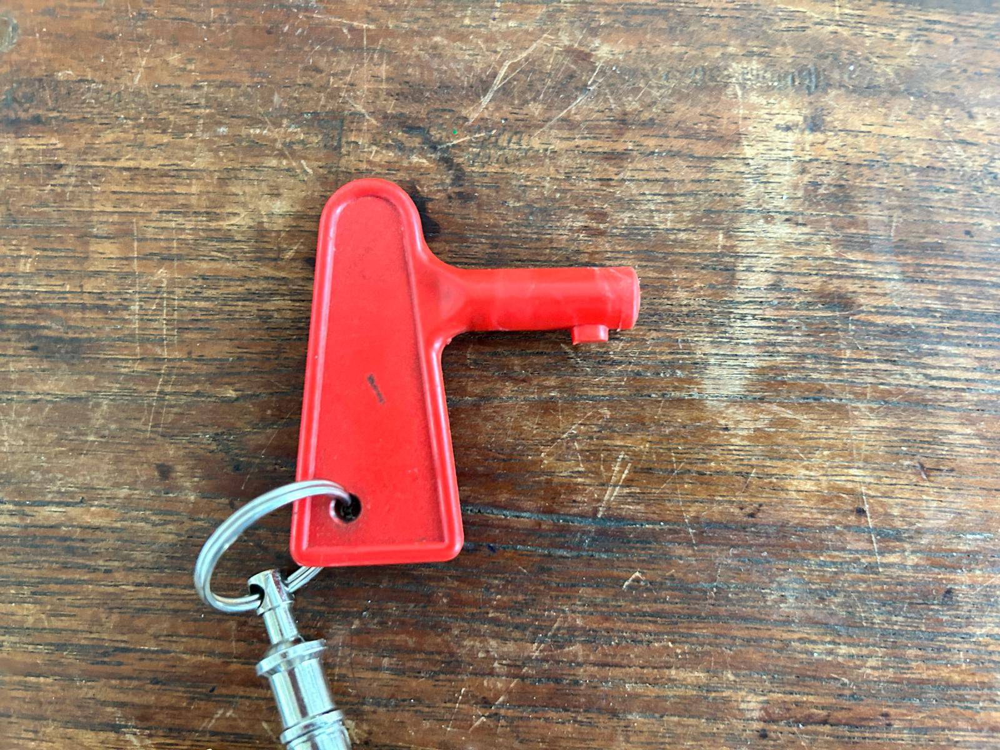
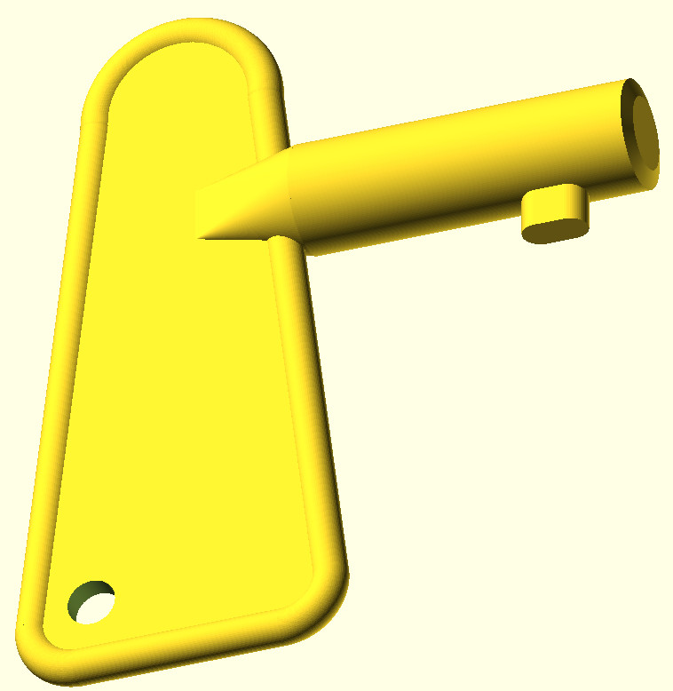
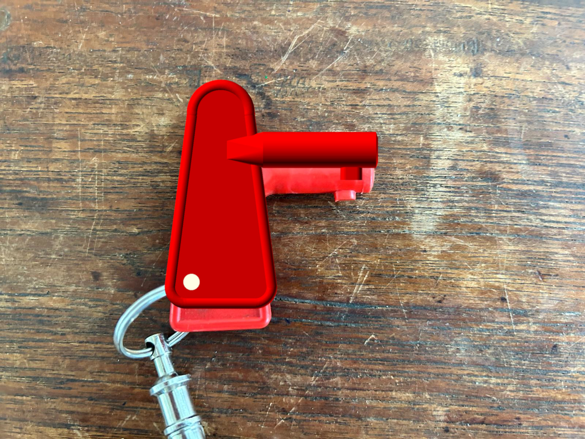
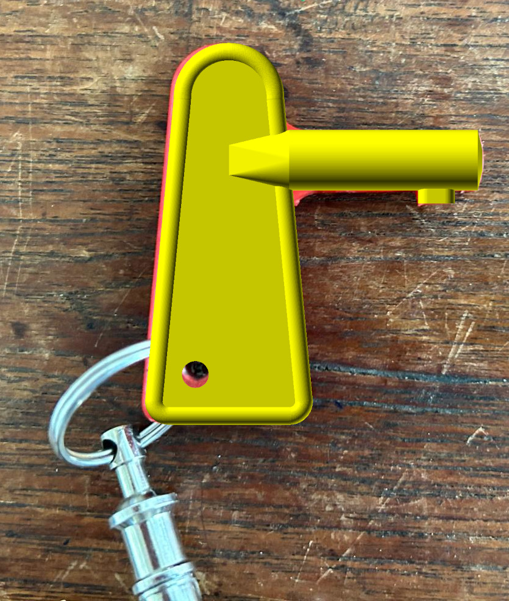
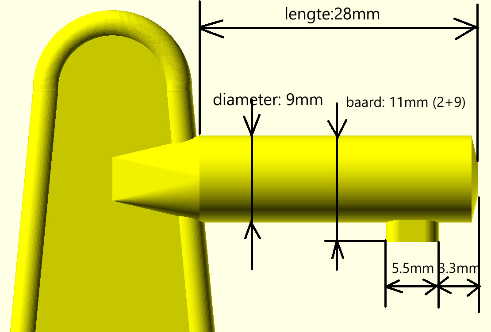
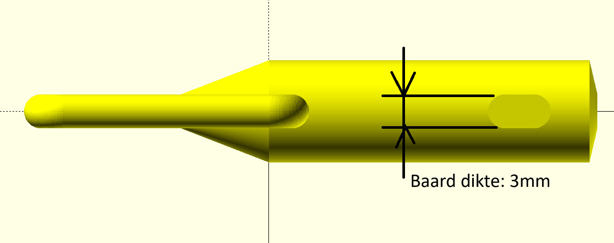
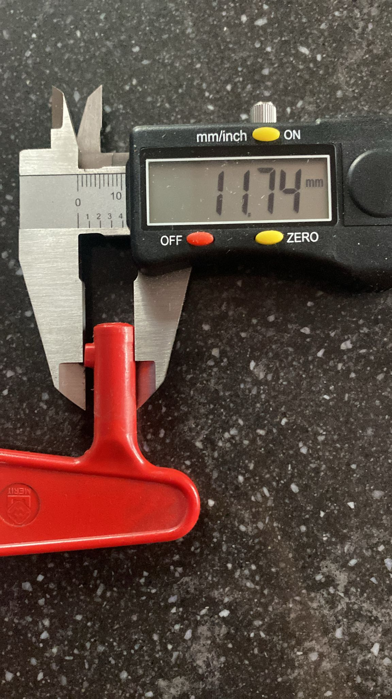
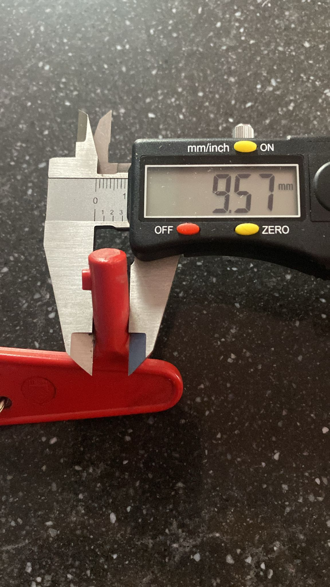
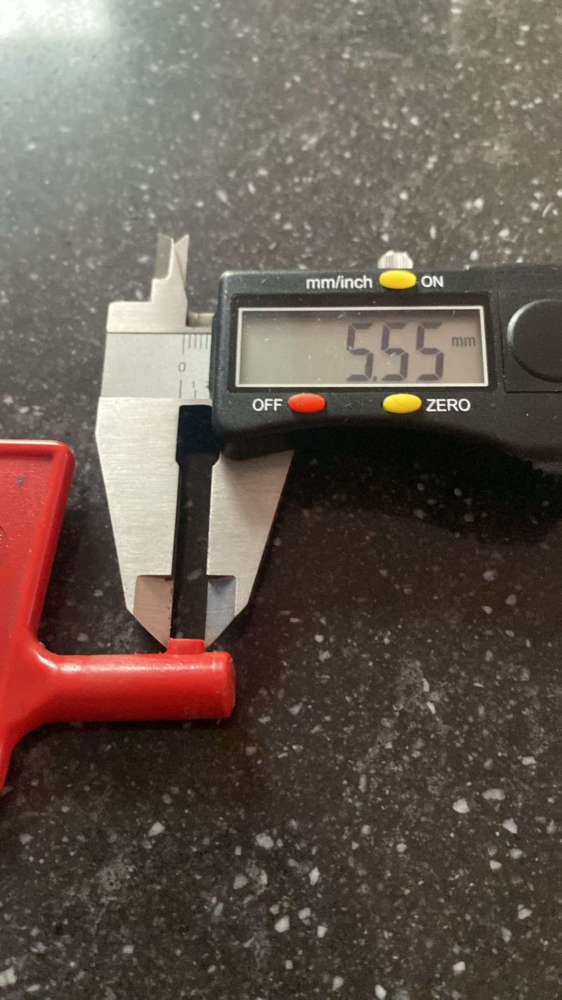
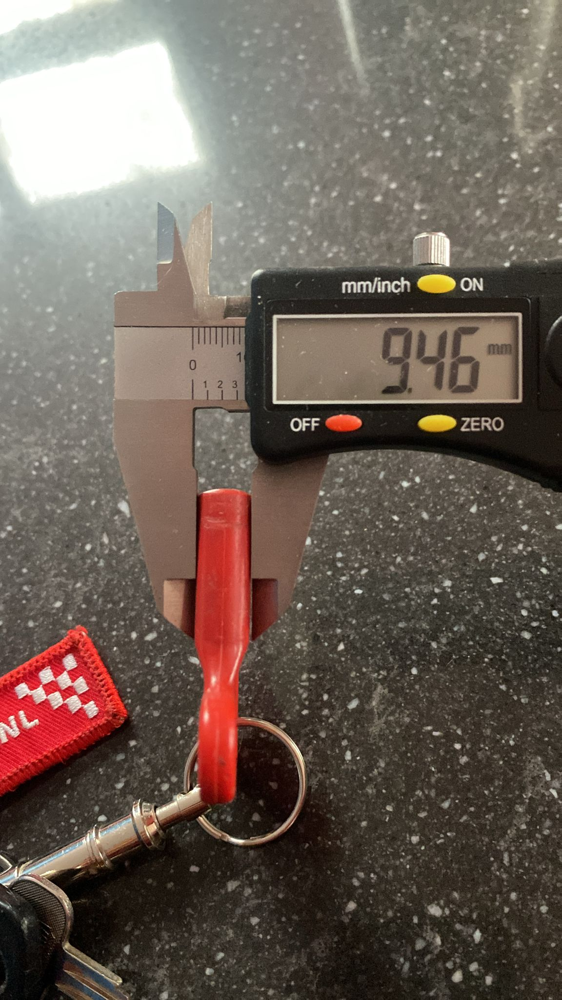

This folder contains the open scad design of a ciruit breaker key

It is not perfect since Rendering will take ages but finally
it did render and i got it printed as well (using PETG)

Some notes and images/photos

- 14-10-2024 started working on the circuit breaker key based on a first 
  
  
  
  
  
- 28-10-2024 some pictures with some details
  
  
  
  
  
  
- 08-11-2024 printed (without logo but not sure why that was missing)
  - rendering duurde lang
  - suspect are the sharp corners on the edge of the handle
  - matching the design using
  - 
- Following helped a lot getting some measurements from the first photograph
  - https://eleif.net/photomeasure

