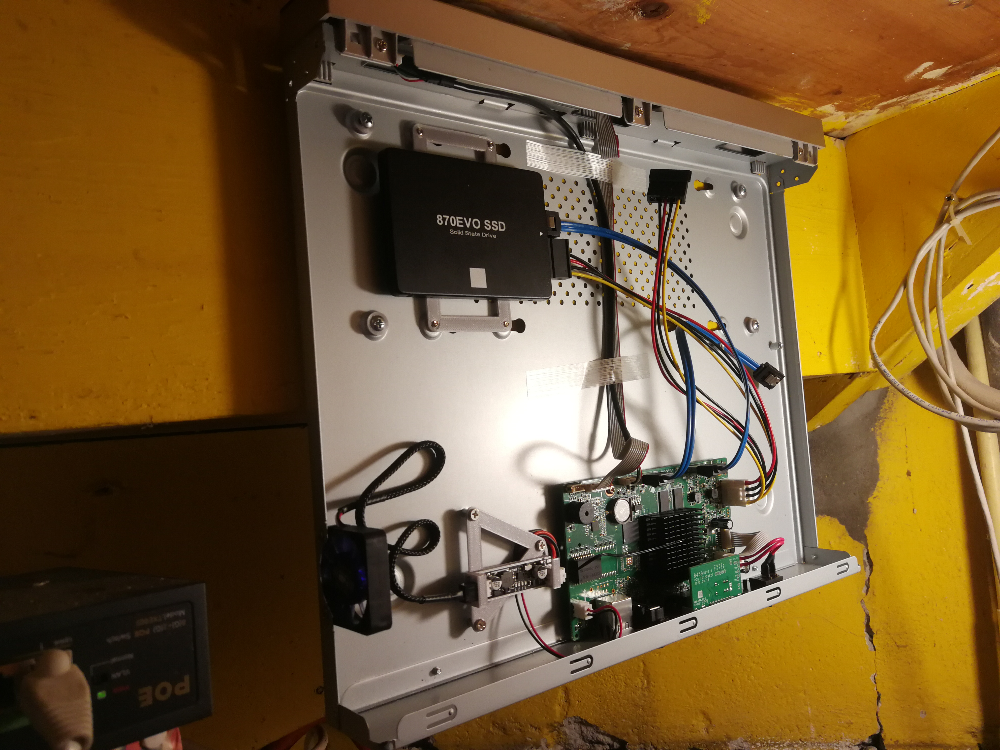
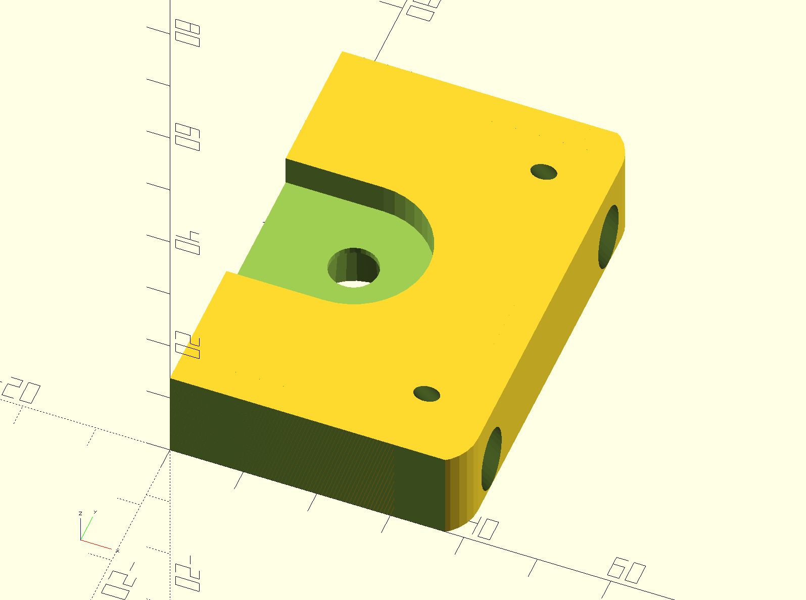
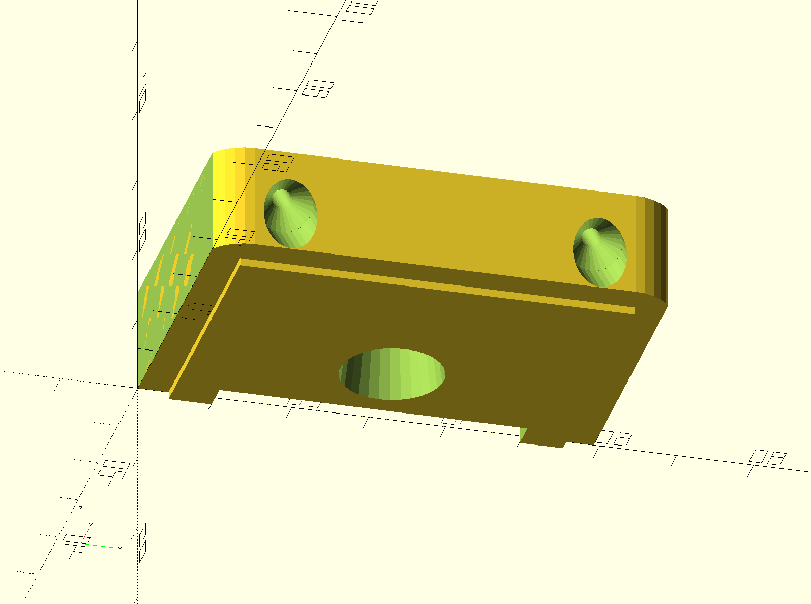
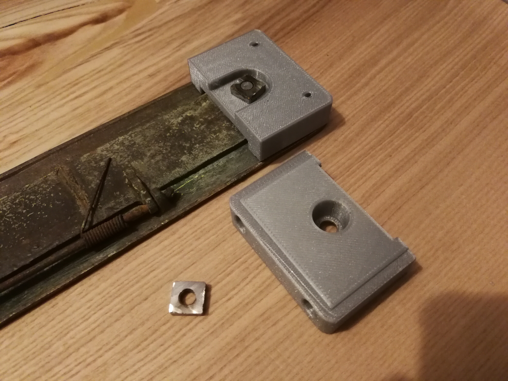

This folder contains a small collection of brackets

# Raspberry Pi

The Pi has its own folder with projects including this wall mount [bracket](../pi/pi_wall_mount.scad). See also [pi Readme](../pi/Readme.md)

# Network Video Recorder (NVR)

My NVR also needed some work. It was noisy as hell so the

- HDD needed to be replaced with an SSD 
  (see this [bracket design](../xdd/hdd35_25_bracket_nvr.scad) 
  in the [xdd folder](../xdd/Readme.md))
- The fan also needed to be replaced with a silent fan and fan controler
  - the fan controler needed a [bracket](fan_control_bracket_nvr.scad) to hold it in place
  - glue worked fine but this bracket works even better!

There is also a design for a base bracked to mount the NVR against the wall
this never got printed and I mounted it using 4 washers directly to the wall...

# Letterbox

We wanted to mount an old letterbox shield on our former front door.

- 
- 
- 
- 
