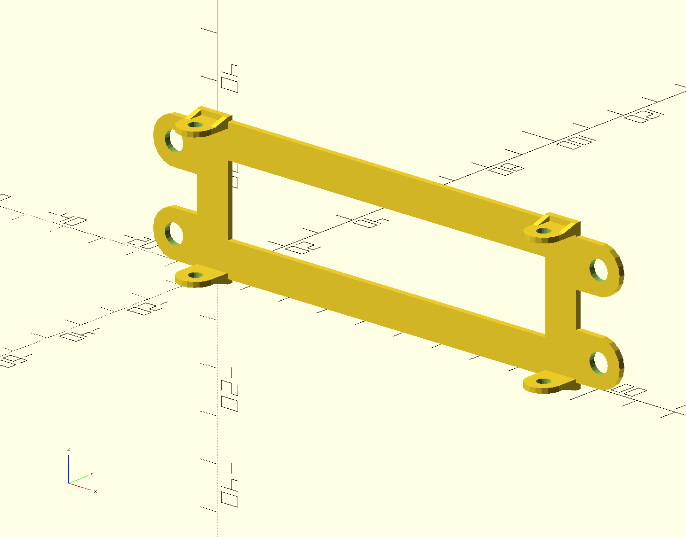
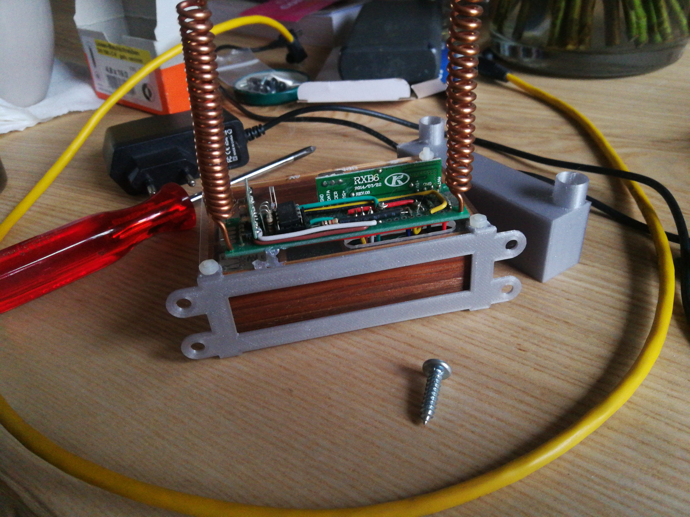
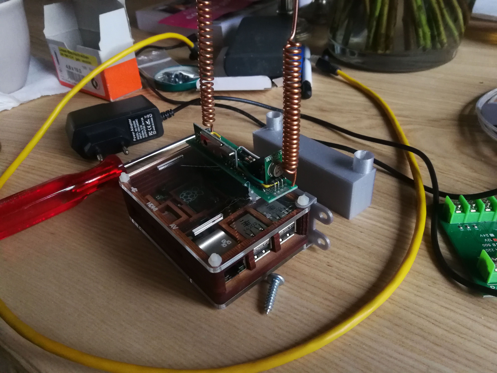
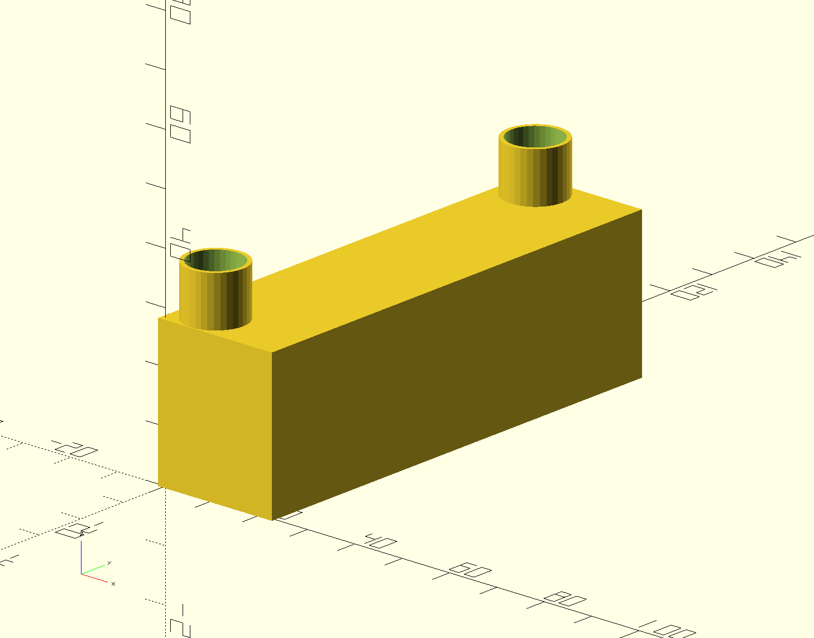
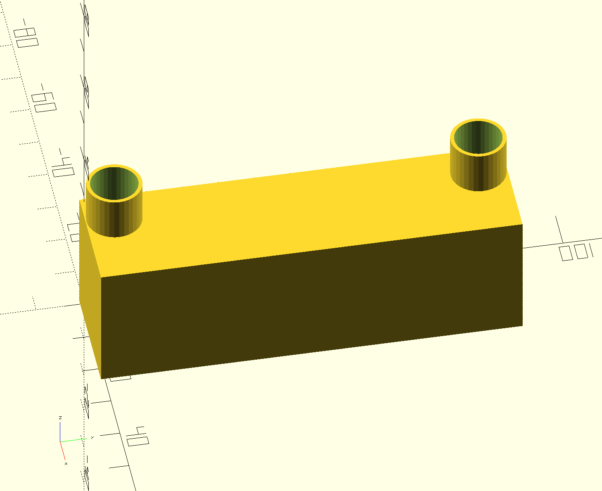
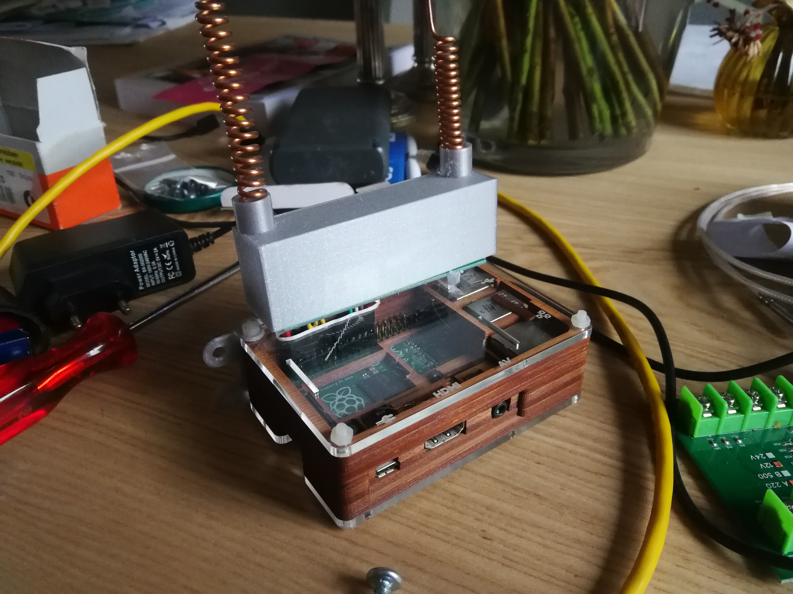

This folder contains a number of small design for an old
raspberry pi. It is one of my first Raspberries.

Raspberry Pi2 model B Plus Rev 1.2

- Wall mount bracket
  - 
  - 
  - 
- Dust cap for the 433MHz RF module 
  - 
  - 
  - 
  - 
