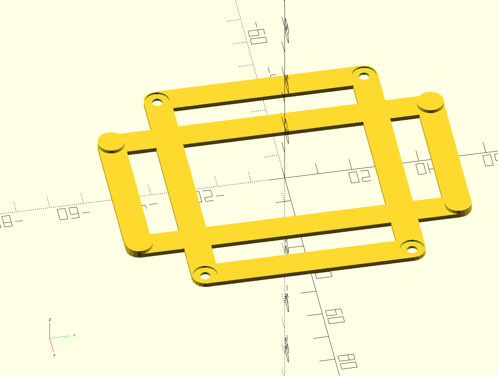

Here a design to mount a 2.5" SSD in a place only suitable for a 3.5" HDD. *It looks like the [checked in](hdd35_25_bracket_nvr.scad) version of the scad file was not saved since the design shows now holes in he design image below*

